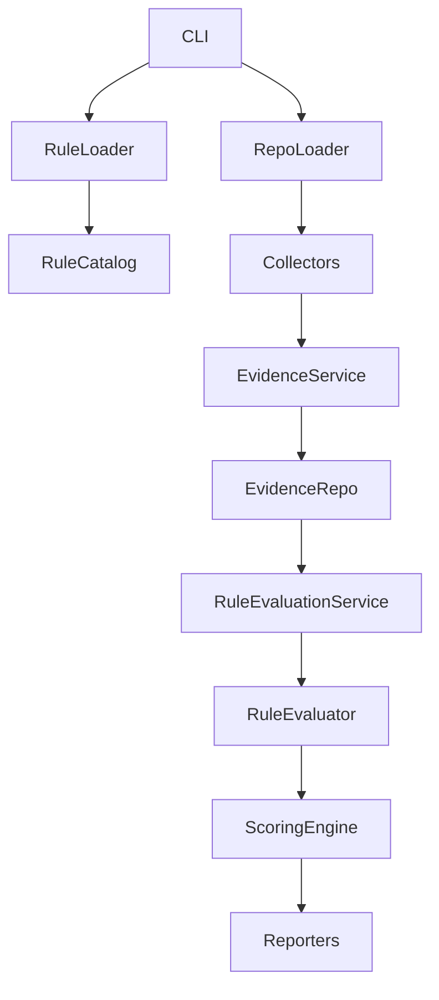

# Architecture

## Components

- CLI: coordinates commands and user interaction.
- Rule Loader: reads declarative YAML rule files and validates schema.
- Rule Catalog: in-memory query layer over loaded rules (`all`, `get`, `by_category`, `enabled`).
- Repository Loader: validates repository paths and produces a `RepositoryContext`.
- Evidence Collectors: small, focused classes that gather raw evidence from filesystem artifacts.
- Evidence Repository: in-memory store for evidence items.
- Evidence Collection Service: runs collectors, deduplicates exact duplicates, and stores evidence.
- Rule Evaluator: evaluates one `RuleDefinition` deterministically against evidence requirements.
- Rule Evaluation Service: evaluates all rules and produces ordered `RuleResult`s.
- Scoring Engine: converts rule results into weighted scores, including core readiness, advanced controls, and assessment coverage.
- Reporting: builds and renders deterministic console/JSON/Markdown readiness reports.

Dependency direction is strictly top-down from CLI → Rule Loader/Rule Catalog and CLI → Repository Loader → Collectors → Evidence Collection Service → Evidence Repository → Rule Evaluation Service → Rule Evaluator → Scoring Engine → Reporters.

Evaluation flow: Repository → EvidenceCollectionService → EvidenceRepository → RuleEvaluationService → RuleResult → ScoringService → ReportBuilder/ReportWriter.

Evidence collection remains separate from rule evaluation. Collectors only capture raw facts; rules are declarative and evaluated later by RuleEvaluator.

EARF now includes deterministic scoring and reporting. Production status is based primarily on applicable core controls and core critical blockers.

Future extension points: additional deterministic collectors/patterns, richer capability signals, and optional external integrations.

Collectors must not embed category-specific logic (e.g., RAG, safety, privacy). This prevents duplication and keeps rules portable.

