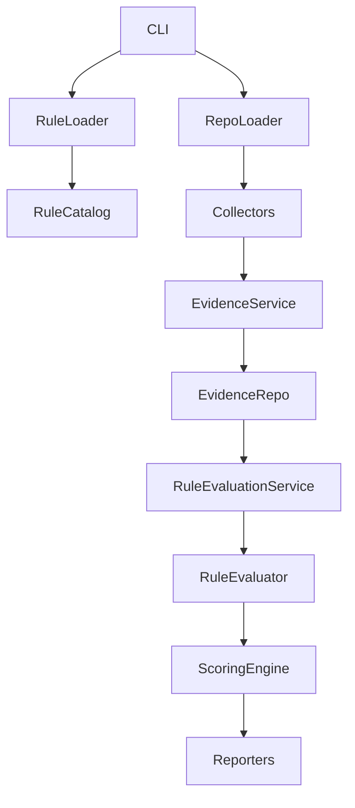

# Architecture (Phase 4)

## Components

- CLI: coordinates commands and user interaction.
- Rule Loader: reads declarative YAML rule files and validates schema.
- Rule Catalog: in-memory query layer over loaded rules (`all`, `get`, `by_category`, `enabled`).
- Repository Loader: validates repository paths and produces a `RepositoryContext`.
- Evidence Collectors: small, focused classes that gather raw evidence from filesystem artifacts.
- Evidence Repository: in-memory store for evidence items.
- Evidence Collection Service: runs collectors, deduplicates exact duplicates, and stores evidence.
- Rule Evaluator: evaluates one `RuleDefinition` deterministically against evidence requirements.
- Rule Evaluation Service: evaluates all rules and produces ordered `RuleResult`s.
- Scoring Engine: converts rule results into category and overall scores (placeholder).
- Reporters: render `AssessmentReport` into different formats.

Dependency direction is strictly top-down from CLI → Rule Loader/Rule Catalog and CLI → Repository Loader → Collectors → Evidence Collection Service → Evidence Repository → Rule Evaluation Service → Rule Evaluator → Scoring Engine → Reporters.

Phase 4 evaluation flow: Repository → EvidenceCollectionService → EvidenceRepository → RuleEvaluationService → RuleResult.

Evidence collection remains separate from rule evaluation. Collectors only capture raw facts; rules are declarative and evaluated later by RuleEvaluator.

Phase 4 implements evidence-to-rule matching only. Scoring and reporting remain placeholders.

Future extension points: real collectors, evidence matching, scoring strategies, readiness levels, report rendering, and optional LLM-assisted analysis.

Collectors must not embed category-specific logic (e.g., RAG, safety, privacy). This prevents duplication and keeps rules portable.

