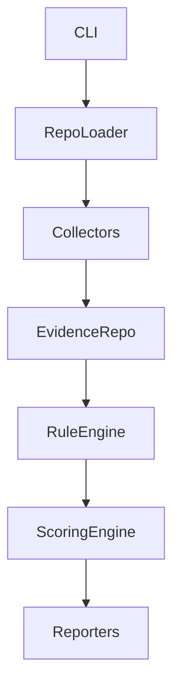

# Architecture (Phase 1)

## Components

- CLI: coordinates commands and user interaction.
- Repository Loader: validates repository paths and produces a `RepositoryContext`.
- Evidence Collectors: small, focused classes that gather raw evidence (placeholders in Phase 1).
- Evidence Repository: in-memory store for evidence items.
- Rule Engine: evaluates `RuleDefinition`s against evidence (placeholder).
- Scoring Engine: converts rule results into category and overall scores (placeholder).
- Reporters: render `AssessmentReport` into different formats.

Dependency direction is strictly top-down from CLI → Repository Loader → Collectors → Evidence Repository → Rule Engine → Scoring Engine → Reporters.

Evidence collection must remain separate from rule evaluation. Collectors only capture raw facts; rules are declarative and evaluated later by the Rule Engine.

Future extension points: adding real collectors, rule loaders (YAML/JSON), a rules database, scoring strategies, and reporters.

Collectors must not embed category-specific logic (e.g., RAG, safety, privacy). This prevents duplication and keeps rules portable.

