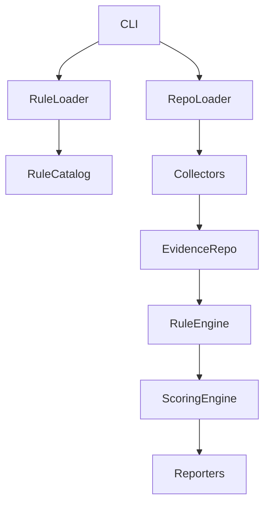

# Architecture (Phase 2)

## Components

- CLI: coordinates commands and user interaction.
- Rule Loader: reads declarative YAML rule files and validates schema.
- Rule Catalog: in-memory query layer over loaded rules (`all`, `get`, `by_category`, `enabled`).
- Repository Loader: validates repository paths and produces a `RepositoryContext`.
- Evidence Collectors: small, focused classes that gather raw evidence (placeholders in Phase 1).
- Evidence Repository: in-memory store for evidence items.
- Rule Engine: evaluates `RuleDefinition`s against evidence (placeholder).
- Scoring Engine: converts rule results into category and overall scores (placeholder).
- Reporters: render `AssessmentReport` into different formats.

Dependency direction is strictly top-down from CLI → Rule Loader/Rule Catalog and CLI → Repository Loader → Collectors → Evidence Repository → Rule Engine → Scoring Engine → Reporters.

Evidence collection must remain separate from rule evaluation. Collectors only capture raw facts; rules are declarative and evaluated later by the Rule Engine.

Phase 2 implements YAML rule loading and validation only. Rule evaluation, scoring, and reporting remain placeholders.

Future extension points: real collectors, evidence matching, scoring strategies, readiness levels, report rendering, and optional LLM-assisted analysis.

Collectors must not embed category-specific logic (e.g., RAG, safety, privacy). This prevents duplication and keeps rules portable.

